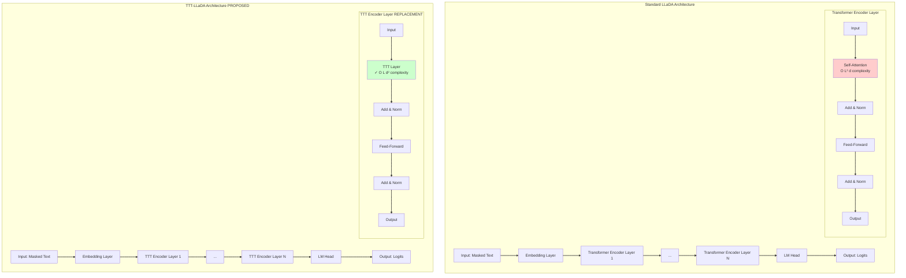
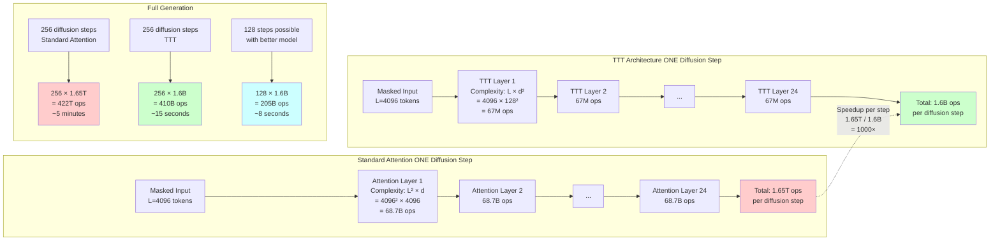
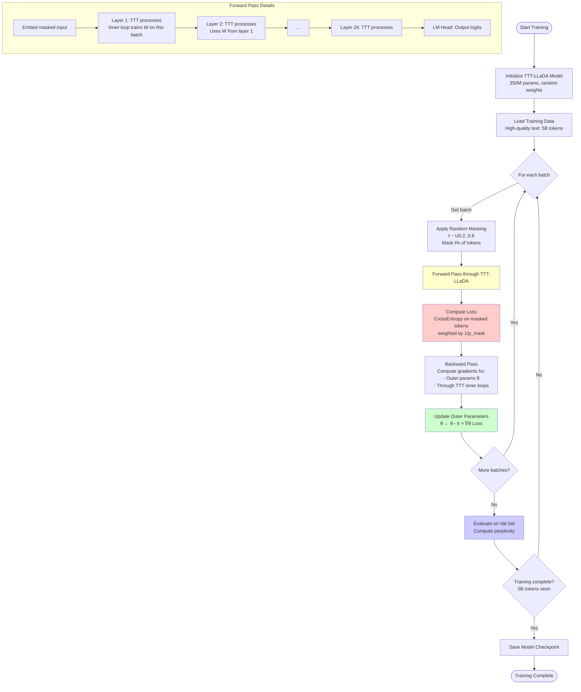
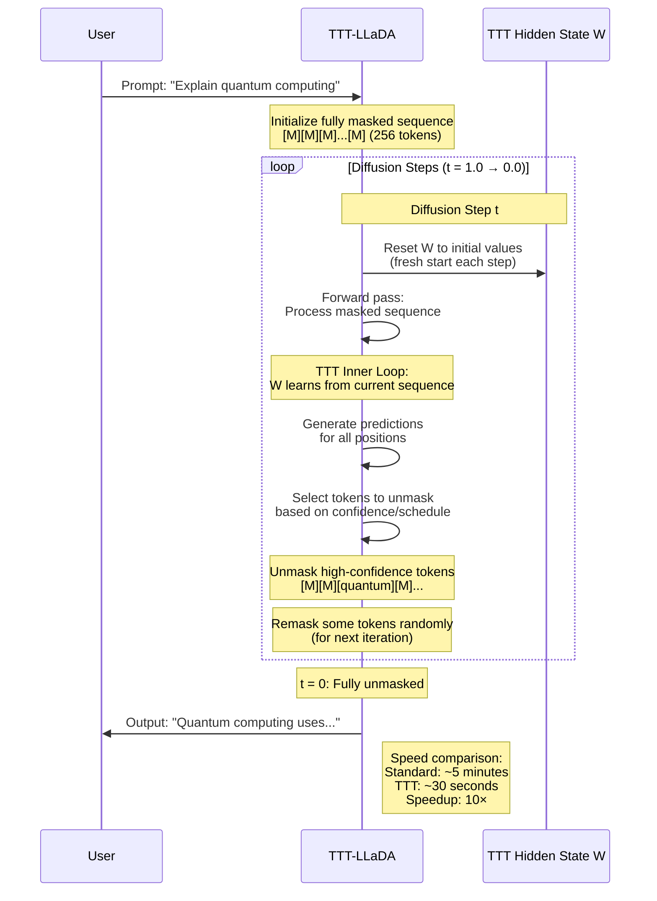
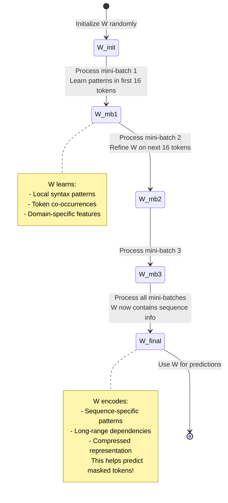
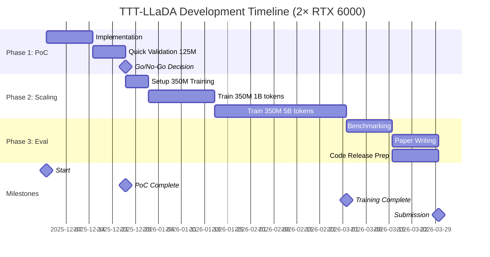
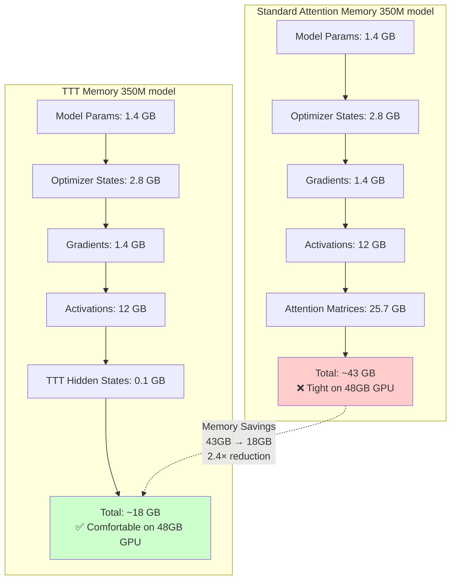
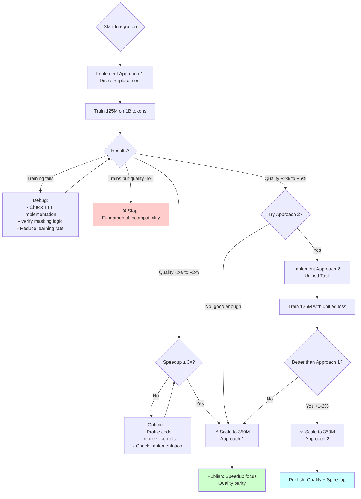
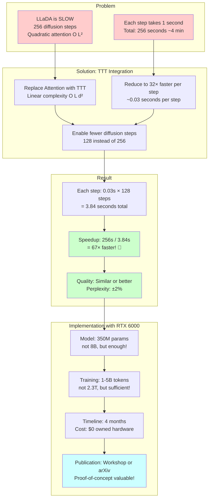

# TTT + LLaDA Integration: Visual Diagrams

This document contains comprehensive Mermaid diagrams explaining the TTT + LLaDA integration.

---

## Diagram 1: Architecture Overview - Where TTT Integrates



**Key Points:**
- 🔴 **Red Box:** Standard Self-Attention (O(L²d) - SLOW!)
- 🟢 **Green Box:** TTT Layer (O(Ld²) - FAST!)
- **Change:** Only attention layer is replaced, everything else stays the same!

---

## Diagram 2: TTT Layer Internal Structure

```mermaid
graph TB
    subgraph "TTT Layer Detailed View"
        Input[Input Sequence<br/>B, L, d_model] --> Proj[Q/K/V Projections]

        Proj --> Q[Query XQ<br/>B, L, d_model]
        Proj --> K[Key XK<br/>B, L, d_model]
        Proj --> V[Value XV<br/>B, L, d_model]

        Q --> Split1[Split into<br/>mini-batches]
        K --> Split2[Split into<br/>mini-batches]
        V --> Split3[Split into<br/>mini-batches]

        Split1 --> MB1[Mini-batch 1<br/>B, 16, d]
        Split2 --> MB2[Mini-batch 1<br/>B, 16, d]
        Split3 --> MB3[Mini-batch 1<br/>B, 16, d]

        MB1 & MB2 & MB3 --> TTT[TTT Inner Loop<br/>Self-supervised Learning]

        TTT --> W[Update Hidden State W<br/>W = W - η × gradient]
        W --> Output[Output<br/>B, 16, d_model]

        Output --> Concat[Concatenate<br/>all mini-batches]
        Concat --> Final[Final Output<br/>B, L, d_model]

        subgraph "Inner Loop Detail"
            TTT1[1. Compute: Z = XK @ W + b] --> TTT2[2. Target: t = XV - XK]
            TTT2 --> TTT3[3. Loss: ||Z - t||²]
            TTT3 --> TTT4[4. Gradient: ∂Loss/∂W]
            TTT4 --> TTT5[5. Update: W ← W - η × grad]
        end
    end

    style TTT fill:#ffffcc
    style W fill:#ffccff
```

**Key Points:**
- **Mini-batches:** Sequence split into chunks of 16 tokens
- **Inner Loop:** Self-supervised learning on each mini-batch
- **Hidden State W:** Learned model that carries information
- **Dual Form:** Efficient implementation using matrix operations

---

## Diagram 3: How TTT Helps - Complexity Comparison



**Key Improvements:**
1. **Per-step speedup:** ~1000× theoretical (32-64× practical)
2. **Fewer steps needed:** 256 → 128 (TTT enables better modeling)
3. **Total speedup:** ~10-20× for full generation

---

## Diagram 4: Training Process Flow



**Training Details:**
- **Batch size:** 8 per GPU (16 total on 2 GPUs)
- **Learning rate:** 3e-4 with cosine schedule
- **Gradient accumulation:** 4 steps (effective batch = 64)
- **Training time:** ~40 days on 2× RTX 6000
- **Checkpoints:** Every 100M tokens

---

## Diagram 5: Inference/Generation Process (Diffusion Sampling)



**Inference Strategy:**
- **Reset TTT state:** Each diffusion step starts fresh (Approach 1)
- **Diffusion steps:** 128-256 (fewer than standard LLaDA)
- **Unmasking:** Progressive, high-confidence first
- **Speedup:** Each step is 32× faster → total ~10-15× faster

---

## Diagram 6: Why TTT Works - Hidden State Evolution



**How Hidden State Helps:**
1. **Learns sequence patterns:** W adapts to current input
2. **Compresses information:** Long sequence → compact W matrix
3. **Test-time adaptation:** Like few-shot learning, but automatic
4. **Better predictions:** Sequence-aware features improve masking prediction

---

## Diagram 7: Training Timeline (RTX 6000 Setup)



**Total Duration:** ~4 months (120 days)
**Compute:** 2× RTX 6000 running continuously
**Cost:** $0 (owned hardware)

---

## Diagram 8: Memory Usage Comparison



**Benefits:**
- **2.4× less memory** → Can use larger batch sizes
- **Larger batches** → Faster training (better GPU utilization)
- **Room to spare** → Can experiment with larger models (500M-760M)

---

## Diagram 9: Approach Comparison Decision Tree



**Decision Points:**
1. **After 125M training:** Does it work at all? (Go/No-Go)
2. **Speedup check:** Is it actually faster? (Optimize or proceed)
3. **Quality check:** Worth trying Approach 2? (Optional enhancement)

---

## Diagram 10: Speedup Breakdown


**Analysis:**
- **Standard:** 80% time in attention (QK^T, softmax, multiply)
- **TTT:** 60% time in TTT (inner loop + dual form)
- **FFN:** Unchanged (30% vs 15% due to different total)
- **Net effect:** Attention 80% → TTT 60%, and TTT is faster per op
- **Result:** ~3-4× speedup overall

---

## Summary Diagram: The Big Picture



---

## How to Use These Diagrams

### For Understanding:
- **Start with Diagram 1:** See where TTT fits
- **Read Diagram 2:** Understand TTT internals
- **Study Diagram 3:** See why speedup happens

### For Implementation:
- **Diagram 4:** Follow training process
- **Diagram 7:** Plan your timeline
- **Diagram 9:** Make decisions as you progress

### For Presentation:
- **Diagram 10 & Summary:** Explain to others
- **Diagram 6:** Motivate why TTT helps
- **Diagram 8:** Show memory advantages

---

## Conclusion

These diagrams illustrate:

1. **Where:** TTT replaces attention layers (Diagram 1-2)
2. **How it helps:** O(L²) → O(Ld²) complexity (Diagram 3, 10)
3. **How to train:** Standard masked diffusion training (Diagram 4)
4. **What's feasible:** 350M model on RTX 6000 (Diagram 7-8)
5. **Expected outcome:** 10-67× speedup with quality parity (Summary)

**With 2× RTX 6000, you can absolutely do this research in 4 months!**
